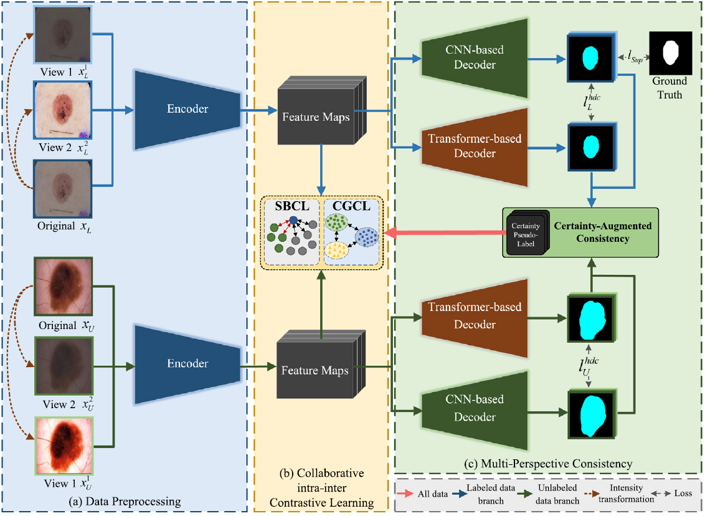
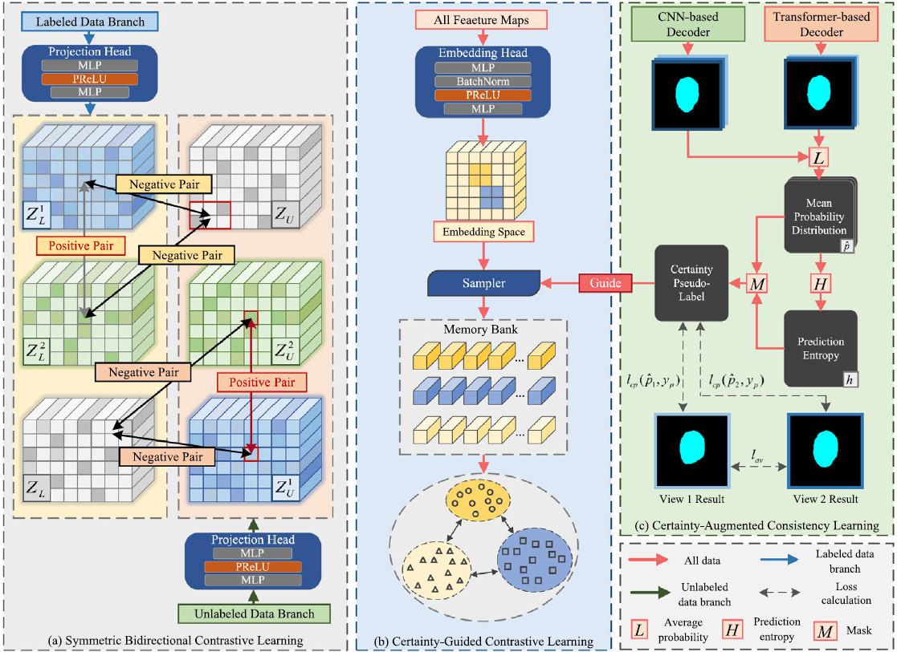

# CCL-MPC: Semi-supervised medical image segmentation via collaborative intra-inter contrastive learning and multi-perspective consistency

> Du X, Zou Y, Lei T, et al. CCL-MPC: Semi-supervised medical image segmentation via collaborative intra-inter contrastive learning and multi-perspective consistency[J]. *Neurocomputing*, 2025, 621: 129287.

## News

Congratulations! This work has been accepted by *Neurocomputing*. The full version of this paper, including detailed information and data, can be accessed at [CCL-MPC](https://www.sciencedirect.com/science/article/pii/S0925231224020587).

## Core idea

### Abstract

Semi-supervised image segmentation extracts specific regions and tissues by utilizing extensive unlabeled
images and limited labeled images, which can alleviate the dependence on plenty of accurately labeled data. However, it is difficult to learn robust feature representations due to the potential noise in pseudo-labels caused by inefficient consistency learning, and poor class diversity in feature spaces. To address this issue, we propose a semi-supervised medical image segmentation method using Collaborative intra-inter Contrastive Learning and Multi-Perspective Consistency (CCL-MPC). First, we propose a collaborative intra-inter contrastive learning strategy that includes symmetric bidirectional contrastive learning and certainty-guided contrastive learning, to exploit the intrinsic differences between inter-image and intra-image feature representations. Second, we design a multi-perspective consistency learning strategy to improve the class diversity by utilizing a dual-branch network and two augmented views. Additionally, we dynamically partition the pseudo-label certainty area for auxiliary consistency learning to reduce the potential noise during the training process. Experimental results on the publicly available datasets demonstrate that CCL-MPC can achieve better segmentation performance than the state-of-the-art methods for semi-supervised medical image segmentation tasks. 

### Figures






## Citation

```
@article{DU2025129287,
title = {CCL-MPC: Semi-supervised medical image segmentation via collaborative intra-inter contrastive learning and multi-perspective consistency},
journal = {Neurocomputing},
volume = {621},
pages = {129287},
year = {2025},
issn = {0925-2312},
doi = {https://doi.org/10.1016/j.neucom.2024.129287},
url = {https://www.sciencedirect.com/science/article/pii/S0925231224020587},
author = {Xiaogang Du and Yibin Zou and Tao Lei and Weichuan Zhang and Yingbo Wang and Asoke K. Nandi},
keywords = {Deep learning, Medical image segmentation, Consistency regularization, Contrastive learning},
}
```


## Acknowledgements
[SSL4MIS](https://github.com/HiLab-git/SSL4MIS)
[UGPCL](https://github.com/taovv/UGPCL)
